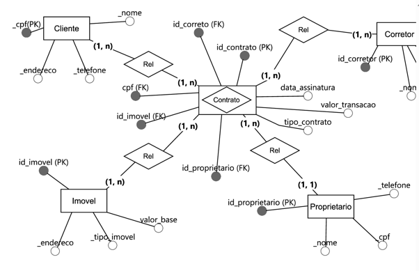
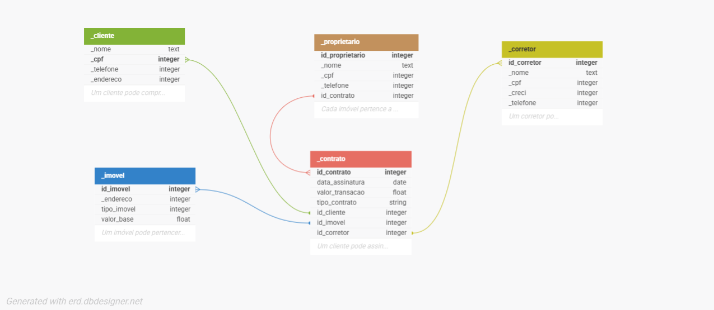

# 📊 Sistema Imobiliário – Modelagem de Dados e API Flask


Este projeto apresenta a evolução de um sistema imobiliário, iniciado pela modelagem de dados e avançando para uma aplicação backend com Flask.

A primeira fase foi desenvolvida a partir de regras de negócio reais, contemplando:

- Modelo Entidade-Relacionamento (MER)
- Database Markup Language (DBML)
- Modelo lógico relacional (SQL)
- Implementação ORM com SQLAlchemy
- Operações CRUD para as entidades principais
- Testes manuais de integração com registros em log

A fase atual do projeto inicia a estruturação de uma API Flask, utilizando:

- Flask
- Flask-SQLAlchemy
- Flask-Migrate
- Alembic
- SQLite

## 🧩 Problema:

A imobiliária realizava o controle de clientes, imóveis, contratos e corretores
de forma manual, o que gerava inconsistências, retrabalho e dificuldade na
geração de relatórios.

# 🏢 Projeto – Sistema de Banco de Dados Imobiliário

## 📌 Contexto

No setor imobiliário, onde há um alto volume de cadastros, contratos e transações,
a ausência de uma estrutura adequada para os dados pode gerar problemas como
informações duplicadas, inconsistentes ou de difícil acesso. A dependência de
registros manuais compromete a agilidade nas consultas, a confiabilidade dos
relatórios e a tomada de decisões estratégicas.

Diante desse cenário, este projeto propõe a modelagem de um banco de dados para
uma imobiliária que enfrenta dificuldades na organização de seus registros,
com dados de imóveis, clientes, contratos e corretores armazenados de forma manual.
A solução tem como foco a informatização do processo a partir de uma modelagem
bem definida.

---

## 🎯 Objetivo

Estruturar os dados do negócio por meio de um **Modelo Entidade-Relacionamento (MER)**,
garantindo a **organização**, a **integridade das informações** e uma **base sólida**
para a informatização e evolução do sistema imobiliário.

---

## 🧭 Escopo do Projeto

O projeto contempla:

- Levantamento e análise das regras de negócio do setor imobiliário
- Definição das entidades, atributos e relacionamentos
- Elaboração do **Modelo Entidade-Relacionamento (MER)**
- Tradução do modelo conceitual para o **modelo lógico**
- Implementação do modelo lógico utilizando **SQLAlchemy**
- Preparação da base para consultas e relatórios futuros

O projeto ainda não contempla, neste momento:

- Interface gráfica
- Integração com sistemas externos
- Autenticação de usuários
- Deploy em produção

A camada de aplicação WEB/API começou a ser estruturada com Flask e será evoluída nas próximas etapas.

---

## 🛠️ Tecnologias Utilizadas

- **Python** – linguagem principal do projeto
- **SQLAlchemy** – ORM para implementação do modelo lógico do banco de dados
- **DBML (Database Markup Language)** – códigos da modelagem
- **SQLite** – banco de dados para ambiente de desenvolvimento
- **Conda** – gerenciamento de pacotes e do ambiente virtual
- **Git e GitHub** – versionamento e controle do código-fonte
- **DB Designer Web** - modelagem de dados
- **BR Modelo Web** - modelagem de dados
- **Flask** – framework web para construção da API
- **Flask-SQLAlchemy** – integração do SQLAlchemy com a aplicação Flask
- **Flask-Migrate** – gerenciamento de migrations
- **Alembic** – controle de versão da estrutura do banco de dados

---

## 📐 Modelagem de Dados

A modelagem de dados segue uma abordagem incremental:

1. **Modelo Conceitual (MER)** – identificação das entidades, atributos e relacionamentos
2. **Modelo Lógico** – definição das tabelas, chaves primárias, chaves estrangeiras e restrições
3. **Implementação Física** – criação do banco de dados utilizando SQLAlchemy

Essa abordagem garante que as regras de negócio sejam corretamente refletidas na
estrutura do banco de dados.

---

## Diagramas da Modelagem

A modelagem do sistema imobiliário foi representada por meio de diagramas conceituais e relacionais, auxiliando na visualização das entidades, atributos e relacionamentos do domínio.

### Modelo Entidade-Relacionamento - Peter Chen



### Modelo Entidade-Relacionamento - James Martin



## 📈 Benefícios Esperados

- Dados organizados e padronizados
- Redução de inconsistências e erros manuais
- Consultas mais rápidas e confiáveis
- Relatórios mais precisos para tomada de decisão
- Base escalável para evolução futura do sistema


## 🏗️ Estrutura do Projeto
```
projeto-imobiliaria/
│
├── README.md
├── docs/
│   ├── intro.md
│   ├── requisitos_negocio.md
│   ├── justificativa_dbml.md
│   └── model_logic.md
│   
├── modelagem/
│   ├── models
│   |    └── __init__.py
|   |    └── base.py
|   |    └── cliente.py
|   |    └── contrato.py
|   |    └── corretor.py
|   |    └── imovel.py
|   |    └── proprietario.py
|   ├── create_tables.py
|   ├── data.base.py
|   ├── modelo.dbml
|   ├── mer_james_martin.png
|   ├── mer_peter_chen.jpg
|── .gitignore
|── requirements.txt

```
## ⚙️ Ambiente Virtual:

O projeto utiliza um ambiente virtual gerenciado pelo Conda.

### Criação do ambiente:
```bash
conda create -n imobiliaria-env python=3.11
```
## Evolução do Projeto:

O projeto evoluiu da etapa inicial de modelagem de dados para a implementacao da primeira camada funcional de persistência.

A versão atual contempla a criação da estrutura ORM com SQLAlchemy, a conexao com banco SQLite, a criação das tabelas, os CRUDs das entidades principais e testes manuais com registro em log.

## Camada de Persistência:

Foram implementadas operações CRUD para as principais entidades do sistema imobiliario:

- Cliente
- Proprietario
- Corretor
- Imovel
- Contrato

Cada entidade possui um arquivo especifico de CRUD dentro da pasta `modelagem`, permitindo criar, listar, buscar por ID, atualizar e deletar registros.

## Testes de integração:

```
Foram criados testes de integridade manuais para validar CRUD, banco SQLite, SQLAlchemy, sessão,
relacionamento entre entidades e criação e exclusão real de registros.
```

Os testes podem ser executados a partir da pasta `modelagem`:

```bash
python run_tests.py
```
*Obs: Também por models*

### Logs:

A execução dos testes gera arquivos de log na pasta:

```modelagem/logs/```

### Logs principais:

```
testes.log
run_tests.log
```

> Esses logs ajudam a acompanhar as validações realizadas durante o desenvolvimento.

### Release v0.1.0:
A release v0.1.0 representa a primeira entrega técnica do projeto, contendo:

```
Conexão com banco SQLite
Modelos ORM com SQLAlchemy
Criação das tabelas
CRUD de Cliente
CRUD de Proprietário
CRUD de Corretor
CRUD de Imóvel
CRUD de Contrato
Testes manuais de integração dos CRUDs
Registro de logs
Execução geral dos testes com 'run_tests.py'
README técnico na pasta modelagem
```
### Link da release:

https://github.com/userdanixdev/project_imobiliaria/releases/tag/v0.1.0

### Estrutura do projeto atualizada:

```
project_imobiliaria/
│
├── README.md
├── requirements.txt
├── .gitignore
│
├── docs/
│   ├── intro.md
│   ├── requisitos.md
│   ├── justificativa_dbml.md
│   └── model_logic.md
│
└── modelagem/
|      └──docs/
|            ├── README.md
|            ├── database.py
|            ├── create_tables.py
|            ├── modelo.dbml
|            ├── mer_james_martin.png
|            └── mer_peter_chen.jpg
|        └── logs/    
|              └── run_tests.log
|              └── testes.log
|        └──tests/    
|            ├── crud_clientes.py
|            ├── crud_proprietario.py
|            ├── crud_corretor.py
|            ├── crud_imovel.py
|            ├── crud_contrato.py
|            │
|            ├── test_connection_db.py
|            ├── test_crud_cliente.py
|            ├── test_crud_proprietario.py
|            ├── test_crud_corretor.py
|            ├── test_crud_imovel.py
|            ├── test_crud_contrato.py
|            ├── test_logger.py
|            ├── run_tests.py|
|
|    
|    └── models/
|        ├── __init__.py
|        ├── base.py
|        ├── cliente.py
|        ├── proprietario.py
|        ├── corretor.py
|        ├── imovel.py
|        └── contrato.py
```

## Evolução para API Flask

Após a primeira etapa de modelagem de dados e implementação dos CRUDs com SQLAlchemy puro, o projeto iniciou uma nova fase de evolução para uma API utilizando Flask.

Essa nova etapa tem como objetivo organizar a aplicação em uma estrutura mais próxima de um projeto web real, preparando o sistema para expor suas funcionalidades por meio de rotas HTTP.

Nesta fase, foram adicionadas as seguintes tecnologias:

- **Flask** – framework web utilizado para criação da aplicação e futuras rotas da API.
- **Flask-SQLAlchemy** – integração entre Flask e SQLAlchemy.
- **Flask-Migrate** – controle de migrations do banco de dados com Alembic.
- **Alembic** – ferramenta utilizada para versionamento da estrutura do banco.

### Application Factory

A aplicação passou a utilizar o padrão Application Factory, por meio da função:

- create_app()

*Esse padrão permite criar a aplicação Flask de forma mais organizada, facilitando testes, configurações por ambiente e crescimento do projeto.*

### Nova Estrutura Flask

Foi criada a pasta `app/`, responsável por concentrar a aplicação Flask:

```text
project_imobiliaria/
│
├── app/
│   ├── __init__.py
│   ├── config.py
│   ├── extensions.py
│   └── models/
│       └── __init__.py
│
├── migrations/
│   └── ...
│
├── modelagem/
│   └── ...
│
├── requirements.txt
└── README.md
```

### Próximos Passos:

As próximas etapas previstas são:

- Finalizar a criação dos models em `app/models/` com Flask-SQLAlchemy.
- Corrigir e padronizar chaves primárias e estrangeiras para uso com Flask-Migrate.
- Gerar e aplicar a migration inicial com Alembic.
- Criar blueprints e rotas da API Flask.
- Implementar endpoints CRUD para as entidades principais.
- Testar os endpoints da API.
- Evoluir os testes para uma estrutura automatizada com `pytest`.
- Criar uma interface web para o sistema imobiliário.

## 📌 Autor
Daniel Martins França

**email:** f.daniel.m@gmail.com  
**Linkedin:** www.linkedin.com/in/danixdev  
**Portifólio:** https://danixdev.blogspot.com/  
**+ Portifólio:** https://padlet.com/fdanielm/danix_dev
